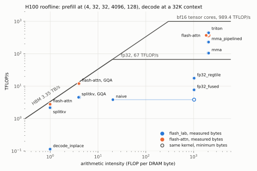

# flash-attention-lab

[](https://github.com/tfan2437/flash-attention-lab/actions/workflows/ci.yml)
[](LICENSE)

FlashAttention-2 forward and KV-cache decode kernels written from scratch: a progression of CUDA
kernels from an unfused fp32 baseline to a pipelined bf16 tensor-core kernel (`mma.sync`,
`ldmatrix`, `cp.async`), the same algorithm in Triton, and split-KV decode that reads a strided
cache in place. They are PyTorch custom ops that work under `torch.compile`, they plug into
Hugging Face transformers as an attention backend, and every one is tested against an fp64
reference and profiled with Nsight Compute on an H100.

## Results on H100

NVIDIA H100 80GB HBM3 (SXM5), bf16 unless noted, op-level timing, median of three runs at commit
cc64b18. Every number is in [summary-cc64b18.md](bench/results/h100-80gb-hbm3/summary-cc64b18.md),
which links to the result files; the method and the clock behavior are in the
[performance report](docs/perf-report.md#method). Causal TFLOP/s count half the work of
non-causal, the FlashAttention-2 convention.

**Prefill** at (B, H, H_kv, S, D) = (4, 32, 32, 4096, 128), TFLOP/s:

| implementation | non-causal | causal | vs flash-attn 2 |
|---|---|---|---|
| `mma_pipelined` (CUDA, `mma.sync` + `cp.async`) | 229.2 | 216.7 | 0.62x / 0.67x |
| `triton` (Triton 3.4, compiles to `wgmma` on Hopper) | 442.3 | 391.4 | 1.20x / 1.21x |
| flash-attn 2.8.3 | 369.3 | 325.4 | 1.00x |
| PyTorch SDPA, flash backend | 328.7 | 300.3 | 0.89x / 0.92x |
| PyTorch SDPA, cuDNN backend | 610.5 | 543.8 | 1.65x / 1.67x |

At equal clocks under Nsight Compute, `mma_pipelined` runs at 0.59x and `triton` at 1.17x
flash-attn's speed. flash-attn 2 does not use Hopper's warpgroup MMA, which Triton reaches through
its compiler; cuDNN uses it and Hopper's other features and is the fastest here.

**Decode**, one new token per sequence, 32K-token KV cache, H = 32, D = 128, GB/s and % of the
3.35 TB/s HBM peak:

| shape | `splitkv` | flash-attn 2 |
|---|---|---|
| B = 1, 32 KV heads | 2,171 (64.8%) | 2,780 (83.0%) |
| B = 8, 32 KV heads | 2,692 (80.3%) | 2,632 (78.6%) |
| B = 8, 8 KV heads (GQA) | 1,135 (33.9%) | 3,004 (89.7%) |

Split-KV is 26x the copy-based baseline for one sequence and on par with flash-attn at batch 8;
with grouped KV heads it is 0.38x flash-attn, the largest gap left ([why](docs/perf-report.md#decode)).

**End to end**, Llama-3.1-8B-Instruct, batch 1, 256 generated tokens, static KV cache with the
decode step compiled into CUDA graphs, against transformers' SDPA path with the same cache:

| prompt | decode step, `flash_lab` | decode step, SDPA | time to first token, `flash_lab` | time to first token, SDPA |
|---|---|---|---|---|
| 512 | 8.21 ms | 10.40 ms | 28.7 ms | 24.8 ms |
| 8,192 | 9.58 ms | 22.68 ms | 274.8 ms | 523.3 ms |
| 32,768 | 14.31 ms | 60.75 ms | 1,587 ms | 5,483 ms |

The 32K row is one run at commit 13a5521 (same kernels). That SDPA path masks the whole static
cache, which keeps PyTorch off its flash kernels; it is the default transformers behavior, not the
best a serving engine does ([details](docs/perf-report.md#end-to-end)). Up to 8K-token prompts,
every timed implementation first passes a logit check against an fp32 copy of the model;
transformers' own `flash_attention_2` path with a static cache fails it.

<picture>
  <source media="(prefers-color-scheme: dark)" srcset="docs/figures/roofline_h100_dark.svg">
  
</picture>

## The progression

Prefill at (4, 32, 32, 4096, 128), non-causal. v0 to v2 are fp32 on CUDA cores; v3 on are bf16 on
tensor cores. Profiler signals from [profiling/metrics.md](profiling/metrics.md).

| version | kernel | what changed | ms | TFLOP/s | what the profiler shows |
|---|---|---|---|---|---|
| v0 | `naive` | four kernels; the S x S scores go through HBM | 286.8 | 3.8 | 53.7 GB of DRAM traffic per call, 50x the minimum |
| v1 | `fp32_fused` | one fused kernel, online softmax | 142.9 | 7.7 | `mio_throttle` leads: two shared-memory loads per FMA |
| v2 | `fp32_regtile` | 4 x 8 register micro-tiles per lane | 62.4 | 17.6 | 6.3x fewer shared-memory wavefronts; 1 block per SM |
| v3 | `mma` | `mma.sync` m16n8k16, P kept in registers as the A operand | 10.52 | 104.5 | tensor pipe 15.9% active, `long_scoreboard` 7.6 cycles per instruction |
| v4 | `mma_pipelined` | two-stage `cp.async` ring, heaviest-first causal order | 4.80 | 229.2 | tensor pipe 37.1%, load stalls gone |
| - | `triton` | the same algorithm in Triton, autotuned | 2.49 | 442.3 | `wgmma` on sm_90a, tensor pipe 49.1% |

Decode goes the same way: `decode_copy` (copies the cache every step, 82 GB/s for one sequence at
32K) to `decode_inplace` (strided in-place reads, 115 GB/s) to `splitkv` (keys split across
blocks, 2,171 GB/s).

## Design

- One FlashAttention-2 loop per block of query rows, with the online softmax in the exp2 domain and
  the scale folded into one FFMA per score ([design](docs/design.md#the-exp2-domain)).
- Tensor-core kernels keep Q and the probabilities in registers: the accumulator fragments of two
  score tiles are exactly the A fragment of the next MMA
  ([fragment layout](docs/design.md#tensor-core-building-blocks)).
- `ldmatrix` loads K as is and V transposed in flight; tile rows padded to `D + 8` elements keep
  every `ldmatrix` free of bank conflicts.
- A two-stage `cp.async` ring overlaps the next tile's loads with the current tile's math
  ([pipeline](docs/design.md#mma_pipelined-v4)).
- Split-KV decode with fp32 partials and a fixed-order log-sum-exp merge; a block serves all query
  heads that share a KV head ([decode](docs/design.md#decode-kernels)).
- `[B, S, H, D]` inputs with any strides; grouped-query attention by index mapping, never by
  repeating K and V; bottom-right causal alignment for `S_q != S_k`.
- Custom ops with fake (shape-only) kernels, so `torch.compile` traces them with
  `fullgraph=True`, and an `attn_implementation="flash_lab"` backend for transformers
  ([flash_lab/hf.py](flash_lab/hf.py)).

## Numerics

Outputs and log-sum-exps are checked against an fp64 reference: an implementation's max error may
be at most twice PyTorch's own error at the same dtype, plus a small floor, the rule of the
flash-attn test suite. Masked rows, ragged tiles, GQA, strided inputs, and split counts are
covered; all CUDA kernels run clean under compute-sanitizer (memcheck, racecheck, synccheck,
initcheck); every kernel is bitwise deterministic for a fixed configuration. Details and measured
errors: [docs/numerics.md](docs/numerics.md).

## Usage

```python
import torch
import flash_lab

q = torch.randn(2, 4096, 32, 128, device="cuda", dtype=torch.bfloat16)  # [B, S, H, D]
k = torch.randn(2, 4096, 8, 128, device="cuda", dtype=torch.bfloat16)  # 8 KV heads
v = torch.randn_like(k)
out, lse = flash_lab.attention(q, k, v, causal=True, return_lse=True)  # impl="auto"

k_cache = torch.randn(2, 32768, 8, 128, device="cuda", dtype=torch.bfloat16)
v_cache = torch.randn_like(k_cache)
seq_lens = torch.tensor([32768, 1000], device="cuda", dtype=torch.int32)
out = flash_lab.decode(q[:, :1], k_cache, v_cache, seq_lens)  # split-KV
```

```python
import torch
from transformers import AutoModelForCausalLM

import flash_lab.hf

flash_lab.hf.register()
model = AutoModelForCausalLM.from_pretrained(
    "meta-llama/Llama-3.1-8B-Instruct", dtype=torch.bfloat16, attn_implementation="flash_lab"
)
```

## Building and running

Linux with CUDA 12 and an sm_80 or sm_90 GPU, tested with torch 2.8 (the newest release with
prebuilt flash-attn wheels, the baseline). Without nvcc the package installs without the extension
and the CPU tests still run.

```bash
pip install -e . --no-build-isolation
pytest -m "not gpu"                                   # CPU: reference, API, harness
pytest                                                # everything, on a GPU
python -m bench.run --suite prefill_bf16              # writes bench/results/<gpu>/*.json
python -m bench.e2e --model meta-llama/Llama-3.1-8B-Instruct
python examples/generate.py --compare sdpa --cache static
```

The GPU work here ran on Georgia Tech's PACE-ICE cluster through the scripts in
[scripts/pace/](scripts/pace/): `final.sh` produces every number the docs cite from one clean
commit, `profiles.sh` the Nsight Compute digests, `sanitize.sh` the compute-sanitizer runs. Setup,
versions, and hardware: [docs/environment.md](docs/environment.md).

## Repository

```
flash_lab/       Python API, fp64 reference, input checks, Triton kernel, transformers backend
csrc/prefill/    naive, fp32_fused, fp32_regtile, mma, mma_pipelined (+ shared mma_tile.cuh)
csrc/decode/     decode_copy, decode_inplace / splitkv, merge
tests/           pytest: reference, kernels, decode, torch.compile, sanitizer subset, Llama
bench/           benchmark harness, suites, end-to-end benchmark, summaries, plots, results/
profiling/       Nsight Compute and Nsight Systems digests, ptxas records, metrics.md
scripts/pace/    build, test, benchmark, and profiling scripts for the cluster
docs/            design, numerics, performance report, environment
examples/        greedy generation with a Llama checkpoint
```

## Origin and scope

This project started from a Georgia Tech CS 7295 assignment in which I wrote fp32 naive and fused
attention kernels. This repository is a from-scratch rebuild outside the course with a new
harness, tests, and benchmarks; every kernel from `fp32_regtile` on is new, and no course-provided
code is included.

Not done, on purpose: the backward pass, variable-length and paged prefill, FP8, multiple GPUs, and
Hopper-specific instructions in the CUDA kernels. FlashAttention-3 and cuDNN get their speed on H100
from those instructions: `wgmma` issues a 64-row matrix multiply per warpgroup asynchronously from
shared memory, TMA copies whole tiles between global and shared memory with one instruction, and
warp specialization lets some warpgroups load while others compute. The CUDA kernels here stay on
the sm_80 instruction set (`mma.sync`, `ldmatrix`, `cp.async`), which is why the Triton kernel,
which reaches `wgmma` through its compiler, is the faster one on this GPU. The open items are listed
in the [performance report](docs/perf-report.md#where-the-gaps-are).

## References

- T. Dao et al. FlashAttention: Fast and Memory-Efficient Exact Attention with IO-Awareness. 2022.
- T. Dao. FlashAttention-2: Faster Attention with Better Parallelism and Work Partitioning. 2023.
- J. Shah et al. FlashAttention-3: Fast and Accurate Attention with Asynchrony and Low-precision.
  2024.
- T. Dao, D. Haziza, F. Massa, G. Sizov. Flash-Decoding for long-context inference. 2023.
- M. Milakov, N. Gimelshein. Online normalizer calculation for softmax. 2018.
- S. Williams, A. Waterman, D. Patterson. Roofline: An Insightful Visual Performance Model. 2009.
- NVIDIA. PTX ISA and CUDA C++ Programming Guide.

MIT License, Copyright (c) 2026 Ting Wei Fan.
